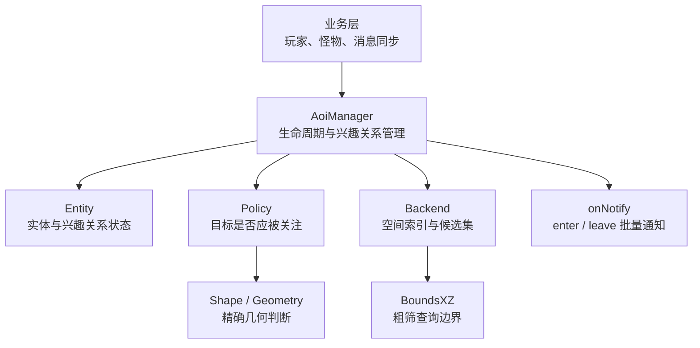
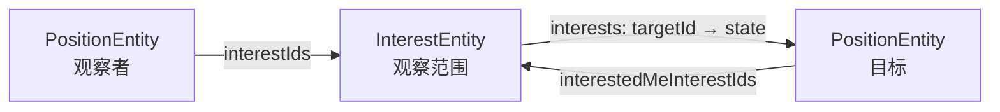
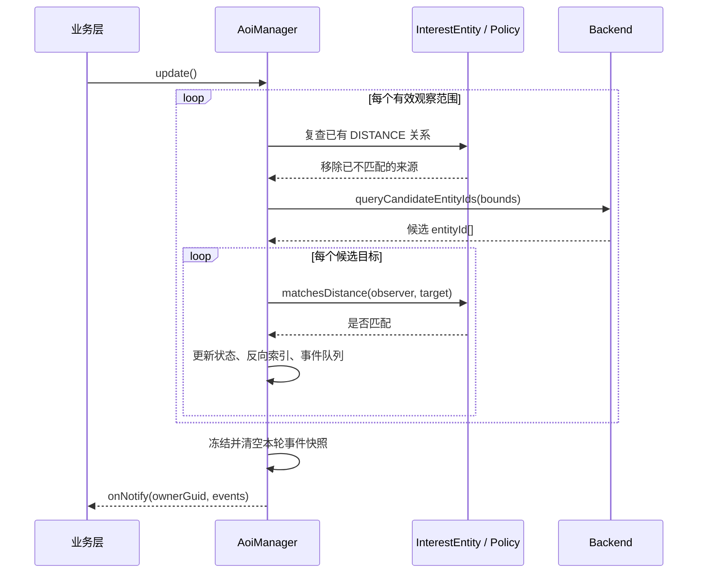

# AOI 框架说明

本目录实现了一个面向实时世界、游戏场景和空间订阅的 AOI（Area of Interest，兴趣区域）框架。

AOI 要解决的核心问题是：**对于一个观察者，在大量场景实体中找出当前应该被它关注的目标，并在可见关系发生变化时产生 `enter` / `leave` 通知。**

例如：

- 玩家只能接收附近玩家、怪物和掉落物的同步消息；
- 一个观察者使用圆形、矩形、扇形或三维区域作为视野；
- 目标进入视野时通知业务层加载目标，离开时通知业务层卸载目标；
- 某些组队成员、任务目标可以不受距离限制，被强制加入关注列表；
- 使用空间索引减少需要执行精确几何判断的目标数量。

当前代码使用 CommonJS 模块，可在 Node.js 16 及以上版本运行。`src/aoi` 内部只依赖 Node.js 与本目录代码，**没有直接使用第三方运行时依赖**。

> 本文档描述的是当前代码实际具备的结构和行为。文末的“使用注意事项与设计边界”集中说明容易误解的接口语义，接入前请先阅读。

## 1. 整体结构

AOI 被拆分为五个主要层次：



各层职责如下：

| 层次 | 负责 | 不负责 |
|---|---|---|
| `AoiManager` | 实体生命周期、观察范围生命周期、兴趣刷新、状态迁移、通知派发 | 具体业务对象、网络发送、持久化 |
| `entity` | 保存实体数据、观察关系和反向索引 | 空间查询算法 |
| `policy` | 组合形状、高度、标签、数量限制，判断目标是否匹配 | 保存全局实体、派发通知 |
| `backend` | 维护空间索引，根据 `BoundsXZ` 返回候选实体 ID | 最终可见性判断 |
| `geometry` / `shapes` | 表达几何数据，计算查询边界，执行精确包含判断 | 实体生命周期和兴趣状态 |

### 1.1 目录结构

```text
src/aoi/
├── README.md                         本文档
├── index.js                          公共导出入口
├── aoi_manager.js                    AOI 总入口和生命周期协调器
├── constants.js                      形状、兴趣状态和事件常量
├── errors.js                         AOI 错误类型
├── validation.js                     通用数值校验
├── backend/
│   ├── abstract_backend.js           空间后端抽象接口
│   ├── brute_backend.js              全量遍历候选后端
│   ├── grid_backend.js               XZ 均匀网格候选后端
│   ├── cross_linked_list_backend.js  X/Z 十字链表候选后端
│   └── structures/
│       └── cross_linked_list.js      十字链表节点、轴链表与范围游标
├── entity/
│   ├── position_entity.js            AOI 中的位置实体
│   └── interest_entity.js            一个独立观察范围及其关系状态
├── geometry/
│   ├── position.js                   三维位置值对象
│   ├── half_extent.js                XZ / XYZ 半尺寸值对象
│   ├── height_range.js               相对高度范围
│   └── bounds.js                     查询边界与世界边界
├── policy/
│   ├── interest_policy.js            兴趣策略抽象接口
│   ├── spatial_interest_policy.js    默认空间兴趣策略
│   └── flag_filter.js                位标志过滤器
└── shapes/
    ├── shape.js                      形状抽象接口
    ├── cycle.js                      XZ 平面圆形
    ├── rectangle.js                  XZ 平面轴对齐矩形
    ├── fan.js                        XZ 平面扇形
    ├── cylinder.js                   三维圆柱体
    └── cuboid.js                     三维轴对齐长方体
```

## 2. 核心概念

### 2.1 实体、观察者和目标

框架中只有一种空间对象：`PositionEntity`。观察者和目标不是两种不同的实体类型，而是实体在一条观察关系中的角色：

- **实体（entity）**：加入 AOI 世界的对象，例如玩家、怪物或掉落物；
- **观察者（observer）**：拥有某个 `InterestEntity` 的实体；
- **目标（target）**：正在被该观察范围检查或关注的实体；
- 同一个实体可以同时是多个关系中的观察者和目标；
- 当前默认逻辑会排除观察者自己，因此不会自动把自己加入自己的兴趣结果。

### 2.2 `guid`、`entityId` 和 `interestId`

这三个标识用途不同，不能混用：

| 标识 | 分配者 | 含义 | 生命周期 |
|---|---|---|---|
| `guid` | 业务层 | 业务对象标识，例如玩家 ID | 由业务决定，在同一 Manager 中必须唯一 |
| `entityId` | `AoiManager` | AOI 内部位置实体标识 | 从 1 单调递增，删除后当前不会复用 |
| `interestId` | `AoiManager` | 一个独立观察范围的标识 | 从 1 单调递增，和 `entityId` 属于不同命名空间 |

业务层通常保存 `addEntity()` 返回的 `entityId`，后续移动、改标签和删除实体都使用它。通知中同时提供内部 ID 和业务 `guid`，业务可按需要选择。

一个实体可以拥有多个 `interestId`。例如同一个玩家可以同时拥有：

- 一个半径较大的普通单位视野；
- 一个只匹配队友的视野；
- 一个用于技能判定的扇形范围。

### 2.3 `PositionEntity`

`PositionEntity` 表示已经注册到 AOI 世界中的位置实体。

| 字段 | 类型 | 含义 |
|---|---|---|
| `entityId` | `number` | Manager 分配的内部实体 ID |
| `guid` | `string \| number` | 业务层唯一标识 |
| `pos` | `Position` | 当前三维坐标；移动必须调用 `AoiManager.moveEntity()` |
| `flags` | `number` | 用于目标分类和过滤的位标志 |
| `interestIds` | `Set<number>` | 此实体拥有的所有观察范围 ID |
| `interestedMeInterestIds` | `Set<number>` | 当前正在关注此实体的观察范围 ID，属于反向索引 |
| `active` | `boolean` | 实体当前是否有效 |

`Position` 是冻结的值对象。需要移动实体时创建一个新的 `Position`，再调用 `moveEntity()`。这样 Manager 才能同步更新空间后端；直接改坐标会绕过索引维护，使查询结果与实体位置不一致。

### 2.4 `InterestEntity`

`InterestEntity` 不是地图中的第二种业务对象，也不是目标实体。它表示：**某个实体拥有的一套独立观察规则，以及这套规则当前关注的目标集合。**

| 字段 | 类型 | 含义 |
|---|---|---|
| `interestId` | `number` | 观察范围的内部唯一 ID |
| `ownerEntityId` | `number` | 拥有此观察范围的实体，即观察者 |
| `policy` | `InterestPolicy` | 候选范围、精确匹配和容量规则 |
| `interests` | `Map<number, number>` | `目标 entityId -> INTEREST_STATE` |
| `active` | `boolean` | 观察范围当前是否有效 |

关系同时保存在两个方向：



反向索引使删除目标时不必扫描所有观察范围，可以直接找到哪些范围正在关注它并生成 `leave`。

## 3. 兴趣状态和事件

同一个观察范围对同一个目标可以同时具有两种“兴趣来源”：

| 状态 | 值 | 含义 |
|---|---:|---|
| `NONE` | `0` | 没有任何兴趣来源，不可见 |
| `DISTANCE` | `1` | 目标通过空间距离规则进入视野 |
| `FORCE` | `2` | 目标被业务强制关注，不依赖距离 |
| `DISTANCE \| FORCE` | `3` | 两种来源同时存在 |

状态使用位标志，是为了让 `DISTANCE` 和 `FORCE` 可以独立增加或移除。事件只关心“整体是否可见”：

| 之前 | 之后 | 事件 |
|---|---|---|
| `NONE` | 任意非零状态 | `enter` |
| 任意非零状态 | `NONE` | `leave` |
| 非零状态 | 另一个非零状态 | 无事件 |

例如目标同时具有 `DISTANCE | FORCE`，离开几何范围只会移除 `DISTANCE`，因为仍有 `FORCE`，所以不会发送 `leave`。只有最后一个来源也被移除时才发送 `leave`。

## 4. 策略层

### 4.1 `InterestPolicy` 接口

自定义兴趣策略需要继承 `InterestPolicy` 并实现以下方法：

| 方法 | 参数 | 返回值 | 能力 |
|---|---|---|---|
| `createCandidateBounds(observer)` | 观察者实体 | `BoundsXZ` | 创建交给 Backend 的粗筛范围 |
| `matchesDistance(observer, target)` | 观察者、目标实体 | `boolean` | 判断目标是否满足普通距离规则 |
| `matchesForced(observer, target)` | 观察者、目标实体 | `boolean` | 判断目标是否允许使用强制关注 |
| `canAcceptDistance(currentInterestCount)` | 当前已关注数量 | `boolean` | 判断是否还能添加新的距离目标 |
| `getMaxAxisExtentXZ()` | 无 | `number` | 返回策略在 X/Z 单轴上的最大查询半径 |

Policy 直接接收完整实体，因此自定义策略不仅能使用位置，还能读取 `guid`、`flags` 等实体字段，不需要额外构造 Context 或 View 对象。

### 4.2 `SpatialInterestPolicy`

默认策略构造函数为：

```js
new SpatialInterestPolicy(shape, heightRange, flagFilter, maxInterest)
```

匹配顺序可以概括为：

```text
shape.contains(observer.pos, target.pos)
    && heightRange.contains(observer.pos, target.pos)
    && flagFilter.matches(target.flags)
```

参数含义：

| 参数 | 含义 |
|---|---|
| `shape` | 视野形状，必填 |
| `heightRange` | 目标相对观察者的 Y 轴范围；默认禁用 |
| `flagFilter` | 目标标签过滤器 |
| `maxInterest` | 此范围允许关注的最大目标数；默认 10 |

`maxInterest` 限制的是当前 `interests.size`。当前实现中强制关注目标也占用这个计数，而且达到上限时不是选择“最近的 N 个”，而是按 Backend 返回候选的先后顺序接纳目标。

### 4.3 `FlagFilter`

构造函数：

```js
new FlagFilter(any, need, forbid)
```

目标必须同时满足：

```js
(targetFlags & forbid) === 0
&& (targetFlags & need) === need
&& (targetFlags & any) !== 0
```

| 参数 | 含义 |
|---|---|
| `any` | 目标至少拥有其中任意一位 |
| `need` | 目标必须拥有这里的全部位 |
| `forbid` | 目标不能拥有其中任何一位 |

示例：

```js
const EntityTag = Object.freeze({
    PLAYER: 1 << 0,
    MONSTER: 1 << 1,
    DEAD: 1 << 2,
});

// 玩家或怪物，并且不能是死亡状态。
const filter = new FlagFilter(
    EntityTag.PLAYER | EntityTag.MONSTER,
    0,
    EntityTag.DEAD
);
```

注意：默认的 `new FlagFilter()` 中 `any === 0`，所以 `(flags & any) !== 0` 永远不成立，默认过滤器不会匹配任何目标。当前实现使用 JavaScript `number` 位运算，位运算按 32 位整数执行，不是 64 位 `BigInt` 标志系统。

## 5. 几何和值对象

### 5.1 基础数据

| 类型 | 字段 | 含义 |
|---|---|---|
| `Position` | `x, y, z` | 三维坐标 |
| `HalfExtentXZ` | `x, z` | X、Z 方向半尺寸；完整宽度分别为 `2x`、`2z` |
| `HalfExtent3D` | `x, y, z` | X、Y、Z 方向半尺寸 |
| `HeightRange` | `min, max` | `target.y - observer.y` 允许落入的闭区间 |
| `BoundsXZ` | `minX, maxX, minZ, maxZ` | Backend 粗筛使用的 XZ 查询边界 |
| `Bounds3D` | 六个轴向边界 | 三维边界数据；当前 Backend 未使用 Y 轴索引 |
| `WorldBounds` | `minPos, maxPos` | Manager 可接受的世界坐标范围 |

`Position`、半尺寸和 Bounds 都是冻结值对象。`WorldBounds.contains()` 使用严格大于/小于判断，因此世界边界上的点不属于世界内部。世界边界只做拒绝判断，不负责裁剪、环绕或自动修正坐标。

`HeightRange(-2, 5)` 表示目标可以比观察者低 2 个单位，也可以高 5 个单位；它不是绝对世界高度。

### 5.2 形状

所有形状都实现三个统一接口：

```js
shape.getQueryBoundsXZ(center); // 用于 Backend 粗筛
shape.contains(center, target); // 精确判断
shape.getMaxAxisExtentXZ();     // 策略范围上限检查
```

| 类 | 构造参数 | 精确范围 |
|---|---|---|
| `CycleXZ` | `radius` | XZ 平面圆形，不限制 Y |
| `RectangleXZ` | `HalfExtentXZ` | XZ 平面轴对齐矩形，不限制 Y |
| `FanXZ` | `radius, yaw, halfAngle` | XZ 平面扇形；角度单位为弧度，`yaw=0` 指向 +X |
| `Cylinder` | `radius, halfHeight` | XZ 圆形加上下各 `halfHeight` 的 Y 范围 |
| `Cuboid` | `HalfExtent3D` | XYZ 轴对齐长方体 |

边界判断采用包含语义，即刚好落在半径、半尺寸或高度边界上的点通常会被视为形状内部。

Backend 只接受 XZ 包围盒，所以查询采用两阶段结构：

1. 形状生成 `BoundsXZ`，Backend 返回可能命中的候选 ID；
2. Policy 调用 `shape.contains()`、高度和标签规则完成精确判断。

扇形当前使用完整圆的外接 Bounds 作为粗筛范围。它可能多返回候选，但不会漏掉扇形内目标；方向和夹角在精确阶段通过点积判断。

## 6. Backend 空间后端

Backend 的职责是维护 `entityId -> 空间位置` 的索引，并返回候选 ID。它不能决定最终可见关系，也不能直接产生 `enter` / `leave`。

### 6.1 抽象接口

```js
addEntity(entityId, pos)
removeEntity(entityId, pos)
moveEntity(entityId, prevPos, nextPos)
queryCandidateEntityIds(boundsXZ)
clear()
```

自定义四叉树、KD 树或其他索引时，只需遵守这个接口。最重要的正确性要求是：`queryCandidateEntityIds()` 可以多返回候选，但不能漏掉 Bounds 内可能命中的实体。

### 6.2 `GridBackend`

`GridBackend(gridSize, maxCellsPerQuery)` 按 XZ 平面划分均匀网格：

- 每个实体只属于一个网格；
- 网格坐标由 `floor(x / gridSize)`、`floor(z / gridSize)` 得到；
- 网格 ID 采用 `"gridX_gridZ"` 字符串；
- 查询遍历 Bounds 覆盖的网格并合并其中的实体 ID；
- Y 轴不参与建索引，三维高度由形状或 Policy 精确判断。

网格越小，候选通常越精确，但一个大范围查询需要访问更多网格；网格越大，访问网格较少，但每个网格可能包含更多无关候选。通常可从常用视野半径的 `1/2` 到 `1` 倍作为压测起点。

### 6.3 `BruteBackend`

`BruteBackend` 不建立空间划分，每次直接返回全部实体 ID。它结构简单，适合：

- 小规模功能验证；
- 与优化后端进行正确性对照；
- 单元测试和问题定位。

它的查询复杂度随实体总数线性增长，不适合大规模生产场景。由于它不维护位置索引，实体移动时不需要调整内部数据，但 `moveEntity()` 仍会返回 `true`，以满足 Backend 的统一调用约定。

### 6.4 `CrossLinkedListBackend`

`CrossLinkedListBackend` 为每个实体创建一个共享节点，并将节点同时挂入按 X
坐标和 Z 坐标排序的两条双向链表：

- 添加、删除和移动实体时同步维护两条轴向链表；
- 查询时估算 Bounds 在 X、Z 数据跨度中的覆盖比例；
- 选择预计扫描比例较小的轴执行闭区间扫描；
- 扫描过程中使用另一轴坐标完成 Bounds 候选过滤；
- 不依赖固定世界边界，也不需要 `gridSize`。

它适合用来测试连续坐标索引和中小规模动态场景。链表的起点定位、插入以及
远距离移动最坏需要线性扫描，因此不能仅凭结构名称假设它一定优于网格；应
结合实体分布、移动幅度和查询范围进行基准测试。

## 7. 一次 `update()` 如何工作



处理顺序的关键点：

1. 先复查并移除已有但失效的 `DISTANCE`；
2. 再通过 Backend 获取新候选；
3. 排除观察者自己、无效实体和已具备 `DISTANCE` 的目标；
4. 使用 Policy 精确匹配并检查容量；
5. 更新双向关系索引；
6. 只在整体可见性发生变化时排队 `enter` / `leave`；
7. 所有观察范围刷新完成后，按观察者 `entityId` 顺序同步调用通知回调。

`update()` 和通知派发期间禁止重入 `update()`。`onNotify` 是同步回调；如果传入 `async` 函数，Manager 不会等待返回的 Promise。

## 8. `AoiManager` 公共接口

构造函数：

```js
new AoiManager(backend, onNotify, maxAxisExtentXZ, worldBounds)
```

| 参数 | 含义 |
|---|---|
| `backend` | 候选空间后端实例 |
| `onNotify` | `(ownerGuid, events) => void` 批量通知回调 |
| `maxAxisExtentXZ` | 所有 Policy 允许使用的最大 X/Z 单轴范围 |
| `worldBounds` | 可选世界边界；传 `null` 表示不限制 |

实体与观察范围接口：

| 方法 | 返回值 | 含义 |
|---|---|---|
| `addEntity(guid, pos, flags)` | `entityId` | 注册实体；重复 guid 或越界会抛错 |
| `removeEntity(entityId)` | `boolean` | 删除实体及其自有观察范围，并解除别人对它的关系 |
| `moveEntity(entityId, pos)` | `boolean` | 同步更新实体位置和 Backend 索引 |
| `changeFlags(entityId, flags)` | `boolean` | 修改目标标签；下一次更新重新计算关系 |
| `addInterestWithPolicy(ownerEntityId, policy)` | `interestId` | 给实体添加一个独立观察范围 |
| `changeInterestPolicy(interestId, policy)` | `boolean` | 替换观察规则；下一次更新生效 |
| `removeInterest(interestId)` | `boolean` | 删除范围并解除其全部关系 |
| `addForceInterest(interestId, targetEntityId)` | `boolean` | 添加强制兴趣来源 |
| `removeForceInterest(interestId, targetEntityId)` | `boolean` | 移除强制兴趣来源 |
| `queryInterestGuids(interestId)` | `guid[]` | 读取范围当前已经建立关系的目标 |
| `update()` | `void` | 刷新所有距离关系并派发通知 |
| `clear()` | `void` | 清理所有实体、范围和 Backend 数据 |

即时空间查询接口：

| 方法 | 含义 |
|---|---|
| `query(shape, center, excludeEntityIds)` | 使用任意 Shape 查询 |
| `queryCircle(center, radius, excludeEntityIds)` | 圆形查询 |
| `queryRectangle(center, halfExtentXZ, excludeEntityIds)` | 矩形查询 |
| `querySquare(center, halfSize, excludeEntityIds)` | 正方形查询 |
| `queryCylinder(center, radius, halfHeight, excludeEntityIds)` | 圆柱体查询 |
| `queryCuboid(center, halfExtent3D, excludeEntityIds)` | 长方体查询 |
| `queryCube(center, halfSize, excludeEntityIds)` | 正方体查询 |
| `queryFan(center, radius, yaw, halfAngle, excludeEntityIds)` | 扇形查询 |

即时查询只执行 Backend 粗筛和 Shape 精确判断：

- 不读取 `FlagFilter`；
- 不检查 `maxInterest`；
- 不创建或修改 `InterestEntity`；
- 不产生 `enter` / `leave`；
- `center` 不要求位于 `WorldBounds` 内；
- 返回值是业务 `guid` 数组，排除集合中放的是内部 `entityId`。

## 9. 完整使用示例

业务代码应从 `src/aoi/index.js` 公共入口导入需要的类型，避免依赖内部目录结构：

```js
"use strict";

const {
    AoiManager,
    GridBackend,
    Position,
    HeightRange,
    WorldBounds,
    CycleXZ,
    FlagFilter,
    SpatialInterestPolicy,
} = require("./src/aoi");

const EntityTag = Object.freeze({
    PLAYER: 1 << 0,
    MONSTER: 1 << 1,
    DEAD: 1 << 2,
});

const backend = new GridBackend(20);
const worldBounds = new WorldBounds(
    new Position(-1000, -100, -1000),
    new Position(1000, 100, 1000)
);

const manager = new AoiManager(
    backend,
    (ownerGuid, events) => {
        console.log("观察者:", ownerGuid);
        for (const event of events) {
            console.log(
                event.event,
                "interestId =", event.interestId,
                "targetGuid =", event.targetGuid
            );
        }
    },
    200,            // Policy 的最大 X/Z 单轴范围
    worldBounds
);

// 业务 guid 与 AOI 内部 entityId 是两个不同概念。
const observerEntityId = manager.addEntity(
    "player-1001",
    new Position(0, 0, 0),
    EntityTag.PLAYER
);

const targetEntityId = manager.addEntity(
    "monster-2001",
    new Position(15, 2, 0),
    EntityTag.MONSTER
);

// 圆形半径 30；目标相对高度允许 [-5, 10]；只看怪物；最多 100 个目标。
const policy = new SpatialInterestPolicy(
    new CycleXZ(30),
    new HeightRange(-5, 10),
    new FlagFilter(EntityTag.MONSTER, 0, EntityTag.DEAD),
    100
);

const interestId = manager.addInterestWithPolicy(
    observerEntityId,
    policy
);

// 首次刷新建立关系，并通过 onNotify 收到 enter。
manager.update();
console.log(manager.queryInterestGuids(interestId)); // ["monster-2001"]

// 移出圆形后，关系不会在 moveEntity 内立即刷新。
manager.moveEntity(targetEntityId, new Position(80, 2, 0));
manager.update(); // onNotify 收到 leave
```

通知中的单个事件结构为：

```js
{
    event: "enter",             // 或 "leave"
    interestId: 1,              // 哪一个观察范围发生变化
    targetEntityId: 2,          // 目标的 AOI 内部 ID
    targetGuid: "monster-2001" // 目标的业务 ID
}
```

`moveEntity()`、`changeFlags()`、`changeInterestPolicy()` 和删除操作只修改数据或把事件加入队列；业务应在合适的逻辑帧调用 `update()` 统一刷新和派发。

### 9.1 即时查询示例

```js
const nearbyGuids = manager.queryCircle(
    new Position(0, 0, 0),
    50,
    new Set([observerEntityId])
);
```

当需求只是“立刻查询这个位置附近有哪些目标”，且不需要持续关系和进出事件时，应使用即时查询，而不是创建临时 `InterestEntity`。

## 10. 扩展方式

### 10.1 自定义 Policy

适合加入阵营、隐身、权限、房间或业务状态规则。应保持以下边界：

- `createCandidateBounds()` 生成的范围必须覆盖所有可能匹配的目标；
- `matchesDistance()` 应是无副作用的布尔判断；
- Policy 不应直接修改 Manager、实体关系或通知队列；
- 复杂业务数据最好通过实体稳定字段或外部只读服务读取，避免判断过程中改变世界状态。

### 10.2 自定义 Backend

可以实现四叉树、KD 树、R 树或分区索引。Backend 只需要处理实体 ID 与空间索引，不需要知道玩家、怪物、标签和可见关系。

若希望后端可以替换，建议让所有修改方法明确返回成功布尔值，并使用同一套契约测试对比 `BruteBackend` 与新后端的候选完整性。

### 10.3 自定义 Shape

继承 `Shape` 后实现粗筛 Bounds、精确 `contains()` 和最大单轴范围。粗筛边界可以不紧致，但绝对不能小于真实形状，否则 Backend 会漏掉正确目标。

## 11. 能力边界

当前框架提供：

- 单进程内的实体位置和标签管理；
- XZ 二维索引，以及在精确阶段执行的 Y 轴判断；
- 多观察范围、多兴趣来源与反向关系索引；
- 圆形、矩形、扇形、圆柱体和长方体判断；
- 基于位标志的目标过滤；
- 批量 `enter` / `leave` 通知；
- 可替换 Policy、Shape 和 Backend；
- 不建立关系的即时空间查询。

当前框架不提供：

- 网络协议、消息序列化或客户端同步；
- 多线程安全、跨进程分片和分布式 AOI；
- 数据库存储和重启后的 ID 恢复；
- 碰撞检测、寻路、遮挡、射线检测和导航网格；
- 自动选择最近的 N 个目标；
- 循环世界、坐标裁剪或越界自动纠正；
- 毫秒计时器或自动更新循环，调用频率由业务层控制。

## 12. 使用注意事项与设计边界

### 12.1 默认 `FlagFilter` 不匹配目标

`FlagFilter` 的默认参数是：

```js
new FlagFilter(0, 0, 0)
```

其中 `any = 0`，而匹配条件要求：

```js
(targetFlags & any) !== 0
```

所以默认过滤器不会匹配任何目标。创建 `SpatialInterestPolicy` 时，应明确传入需要观察的目标标志：

```js
const policy = new SpatialInterestPolicy(
    shape,
    HeightRange.disabled(),
    new FlagFilter(EntityTag.PLAYER | EntityTag.MONSTER, 0, 0),
    100
);
```

如果业务需要“接受任意标志”的语义，应该先为它定义明确规则，而不能把当前默认参数理解为“不过滤”。

### 12.2 `maxInterest` 是容量限制，不是最近目标数量

`maxInterest` 表示一个观察范围当前允许容纳的兴趣关系数量。它不执行距离排序，也不保证保留最近的 N 个目标。

当前实现将 `interestEntity.interests.size` 传给 `canAcceptDistance()`，因此已经存在的 `FORCE` 关系也会占用新增 `DISTANCE` 关系时检查的容量。`addForceInterest()` 本身不受 `maxInterest` 拒绝，所以强制关系可以使总数达到或超过这个值。

当候选数量超过容量时，哪些目标先被接纳取决于 Backend 返回候选的顺序。网格遍历顺序和集合插入顺序都可能影响结果，因此：

- 不要把 `maxInterest` 理解为“最近 N 个”；
- 不要把 `queryInterestGuids()` 的顺序理解为距离顺序或稳定业务顺序；
- 如果需要最近 N 个，应新增明确的候选排序或选择策略，并评估排序成本。

### 12.3 内部 ID 只在所属 Manager 内唯一

`entityId` 和 `interestId` 是公开给同进程 AOI 调用方使用的内部句柄：

- `addEntity()` 返回 `entityId`，移动、删除、修改标志等接口继续使用它；
- `addInterestWithPolicy()` 返回 `interestId`，修改、删除和查询具体观察范围时使用它；
- 两类 ID 使用不同命名空间，所以同一个 Manager 中出现 `entityId = 1` 和 `interestId = 1` 是合法的；
- 不同 `AoiManager` 可以分配出相同的 ID，不需要全局 ID 分配器；
- Manager 重启或实体迁移到另一个 Manager 后，应重新取得内部 ID。

当多个 Manager 的数据汇聚到同一业务层时，内部定位应携带作用域：

```js
{
    managerId: "scene-1001",
    entityId: 25
}
```

跨进程通信、客户端协议和持久化数据应优先使用业务 `guid`，或者使用 `sceneId/managerId + guid`。不要把单独的 `entityId` 或 `interestId` 当作跨进程、跨重启的长期身份。

### 12.4 关系刷新与通知不是全部立即发生

不同操作的生效时机需要区分：

- `moveEntity()`、`changeFlags()` 和 `changeInterestPolicy()` 只修改基础状态；由下一次 `update()` 重新计算 `DISTANCE` 关系；
- 添加或移除 `FORCE`、删除观察范围或删除目标时会直接修改关系，并把事件放入待通知队列；
- 所有排队事件仍然要等下一次 `update()` 才会通过 `onNotify` 派发；
- `queryInterestGuids()` 读取的是当前已经建立的关系，不会隐式调用 `update()`。

业务层应在固定逻辑帧或明确的调度点调用 `update()`，不要依赖查询接口触发刷新。

### 12.5 `update()` 和通知回调是同步的

`update()` 在当前调用栈内完成关系刷新和通知派发，并禁止在更新或通知期间重入。`onNotify` 应保持同步、轻量且无阻塞：

- 不要在 `onNotify` 内再次调用 `update()`；
- 传入 `async` 回调时，Manager 不会等待其返回的 Promise；
- 某个回调抛错时，Manager 会继续尝试派发其余批次，最后重新抛出捕获到的第一个错误；
- 网络发送、数据库写入等耗时操作应交给业务队列处理。

### 12.6 不要绕过 Manager 修改空间状态

业务代码不应直接修改 `PositionEntity.pos`、Backend 的 `cellMap` 或兴趣关系容器。实体移动必须通过：

```js
manager.moveEntity(entityId, newPosition);
```

Manager 需要同时维护实体位置、Backend 空间索引、兴趣关系和反向索引。绕过入口修改其中一层会使这些数据失去一致性。几何值对象采用冻结设计，也是在表达“用新值替换，而不是原地修改”的约束。

## 13. 可视化测试台

仓库提供了针对本目录真实代码的网页测试台：

```bash
node test/aoi_test/backend/server.js
```

然后访问：

```text
http://127.0.0.1:4273
```

测试台可以移动观察者、修改视野形状和地图尺寸，并对比 Manager 兴趣结果、Policy 直接匹配结果和 Shape 即时查询结果。详细说明见 `test/aoi_test/README.md`。
